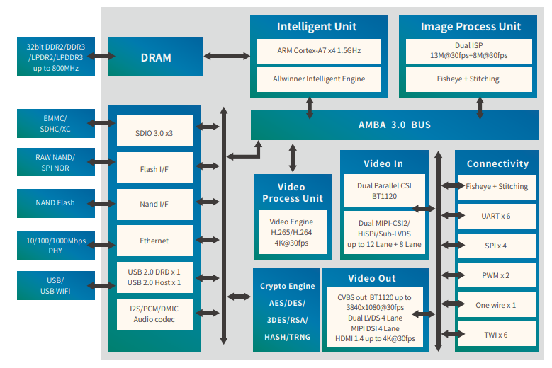

# [V5](https://github.com/mcuyun/V5) 

#### 归属：[cortex A7系列](https://github.com/mcuyun/CA7)
#### [关于悠云](https://github.com/mcuyun)可访问 www.mcuyun.com

## [描述](https://github.com/mcuyun/V5/wiki) 

V5 A7四核，28nm工艺，在单芯片上集成了双ISP

主要特点：双ISP

功能特点：3xSDIO, 20bit audio CODEC 

主要短板：DDR频率低 667MHz-800 MHz maximum

封装：TFBGA (17x17, 0.65mm pitch) 

#### [docs](docs/README.md)

参考设计和数据手册

---

###  [悠云，为嵌入式](http://www.mcuyun.com)   
###  qitas@qitas.cn
