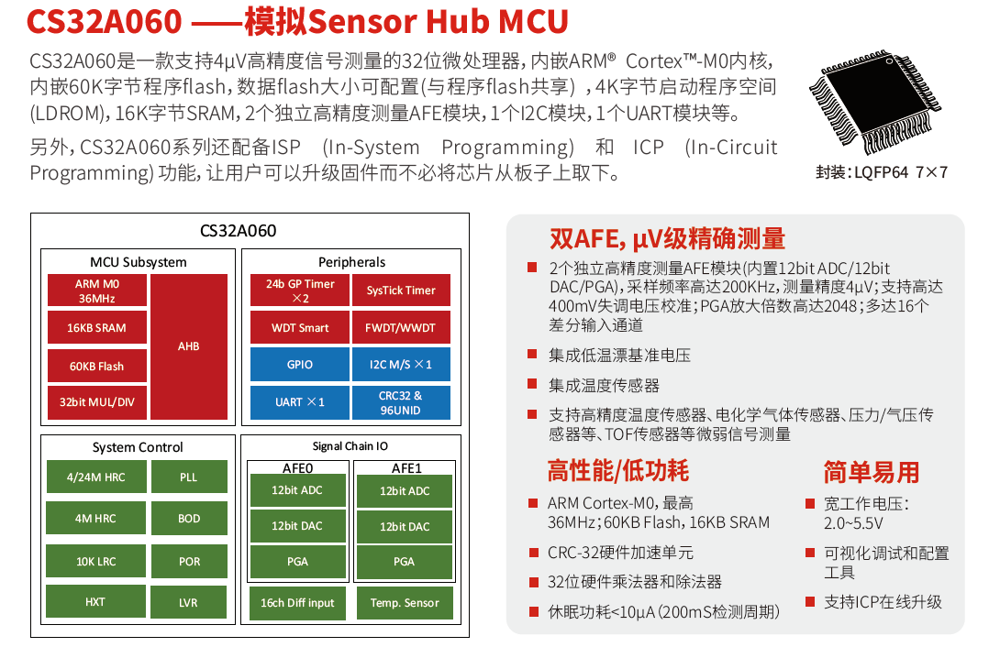

# [CS32A060](https://github.com/SoCXin/CS32A060)

#### [Vendor](https://github.com/SoCXin/Vendor) ：[chipsea](http://www.chipsea.com)
#### [Core](https://github.com/SoCXin/Cortex)：[Cortex M0](https://github.com/SoCXin/CM0)
#### [Level](https://github.com/SoCXin/Level) ：48 MHz * 0.95 DMIPS/MHz

## [简介](https://github.com/SoCXin/CS32A060/wiki)

[CS32A060](http://www.chipsea.com/32weimcu/CS32A060R8T6.html) 集成丰富的信号链IO

#### 关键特性

### [资源收录](https://github.com/SoCXin/CS32A060)

* [参考文档](docs/)
* [参考资源](src/)
* [参考工程](project/)

### [选型建议](https://github.com/SoCXin)

[CS32A060](https://github.com/SoCXin/CS32A060)

###  [www.SoC.xin(芯)](http://www.SoC.Xin)
